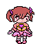

# Crystal Heart Dreamscape

## Project Overview

Welcome to **Crystal Heart Dreamscape**, a charming and mystical Metroidvania-style video game currently under development in Unity. This project is being created as part of an academic assignment.

In Crystal Heart Dreamscape, players will embark on an enchanting journey through a whimsical, dream-like world as a brave magical girl. Explore interconnected areas, uncover hidden secrets, gain new abilities, and battle adorable yet challenging foes to restore peace.

## Features (Current/Planned)

* **Metroidvania-style Exploration:** Discover a sprawling, non-linear world with diverse biomes and hidden passages.
* **Magical Girl Protagonist:** Play as a cute and powerful heroine with unique abilities.
* **Ability Unlocks:** Progress by acquiring new magical powers that open up previously inaccessible areas.
* **Charming Pixel Art:** Experience the world rendered in a delightful pixel art style.
* **Lighthearted & Whimsical Atmosphere:** A focus on positive aesthetics and engaging gameplay.

## Development Status

This project is currently in the **Early Alpha** phase. Key systems are being implemented, and core gameplay loops are being refined:
* Level layout and design
* Refining pixel art animations
* Sounds and musics

## Getting Started

To run and explore the project locally, please follow these steps:

### Prerequisites

* **Unity Hub:** Make sure you have Unity Hub installed.
* **Unity Editor Version:** This project is developed using **Unity Editor version 2023.2.14f1** (or a similar recent LTS version if that's what you are using). It's highly recommended to use this specific version to avoid compatibility issues. You can install it via Unity Hub.
* **Git:** Ensure Git is installed on your system.
* **Git LFS:** Git Large File Storage is crucial for Unity projects due to large binary assets. Install it by running:
    ```bash
    git lfs install
    ```

### Cloning the Repository

1.  Open your Git Bash/Terminal/Command Prompt.
2.  Navigate to the directory where you want to store the project.
3.  Clone the repository using the following command:
    ```bash
    git clone https://github.com/lorenzomaiuri-dev/crystal-heart-dreamscape
    ```
    ```bash
    cd crystal-heart-dreamscape
    ```
5.  Pull any LFS tracked files (this is important!):
    ```bash
    git lfs pull
    ```

### Opening the Project in Unity

1.  Open **Unity Hub**.
2.  Click on the "Add" button (or "Open" if you prefer that flow).
3.  Navigate to the `crystal-heart-dreamscape` folder you just cloned and select it.
4.  Unity Hub should detect the project and its required Unity Editor version. Click "Open Project".
5.  Unity will load the project. This might take a few moments on the first load as it imports assets.

## Project Structure

A brief overview of key folders:

* `Assets/`: Contains all game assets (sprites, sounds, scripts, scenes, prefabs).
    * `Assets/Scenes/`: Game scenes
    * `Assets/Scripts/`: All C# scripts for game logic.
    * `Assets/Materials/`: Materials.
    * `Assets/Animations/`: Animations.
    * `Assets/Palettes/`: Palettes for tilemaps.
    * `Assets/Sprites/`: All pixel art and other image assets. 
    * `Assets/Prefabs/`: Reusable game objects.
* `ProjectSettings/`: Unity's project-specific settings.
* `Packages/`: Package Manager manifest and dependencies.

## Contributing (For Academic Reviewers/Team Members)

While this is primarily an individual academic project, feedback and insights are always welcome!
* **Reporting Issues:** If you find any bugs or have suggestions, please open an issue on the GitHub repository.
* **Code Review:** For academic evaluation, instructors can review the codebase directly in the repository.

## License

This project is licensed under the GNU Affero General Public License v3.0- see the `LICENSE` file for details.

## Contact

For any questions or inquiries about this project, please contact:

**contact@lorenzomaiuri.dev**

---